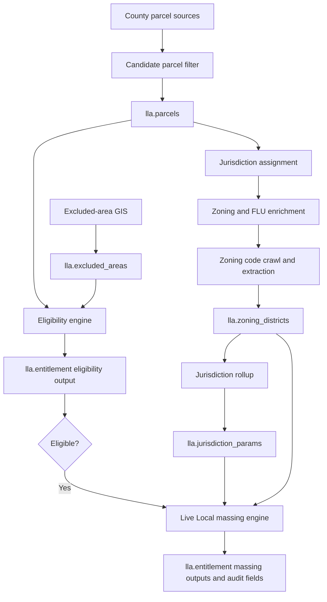

# Live Local Massing Methodology Memo

Project: Live Local Site Intelligence / Live Local Hunter

Statute version: Live Local 4.0, Ch. 2025-172 / CS/CS/SB 1730, effective July 1, 2025

Engine version: `live-local-4.0-2025`

Pilot geography: Miami-Dade, Broward, and Palm Beach counties

This memo explains the methodology behind the project's Live Local parcel screening and massing outputs. It is written for deal, planning, and investment review. It is not a legal opinion, entitlement determination, site-plan approval package, or substitute for review by qualified Florida land-use counsel.

## 1. Executive Summary

Live Local Site Intelligence is a Florida parcel-intelligence engine for finding and explaining potential affordable-housing sites under the Live Local Act. It takes raw parcel and zoning data, screens for parcels that may qualify under the statute, computes deterministic eligibility and massing outputs from stored data, and exposes those facts through an audit-ready context layer.

The product direction is parcel intelligence first. The system is not trying to create a black-box ranking score before the underlying parcel facts are reliable. The near-term value is a defensible answer to questions like:

- Is this parcel plausibly eligible under Live Local?
- What statutory massing envelope does the current data support?
- Which inputs drive unit count, FAR, height, and parking?
- What should counsel, planners, or an analyst verify before relying on the output?
- Can those facts be explained consistently in a chat interface without the model inventing legal or financial conclusions?

The current engine has already moved beyond a simple list of properties. It stores eligibility outcomes, Live Local massing values, the data used to compute them, and flags for missing or approximated statutory inputs. That creates an audit trail for diligence and a foundation for later feasibility, owner outreach, CRM, and map/list prioritization.

## 2. Legal Framework

The implementation is based on the Florida Live Local Act as amended by Live Local 4.0:

- Fla. Stat. Section 125.01055(7), counties
- Fla. Stat. Section 166.04151(7), municipalities
- Ch. 2025-172 / CS/CS/SB 1730, effective July 1, 2025

The county and municipal provisions are parallel. The system treats them as the same massing framework, with jurisdiction-specific local inputs.

### Qualifying Project Context

The statutory massing benefits apply only to qualifying projects. At a high level, the project must be multifamily or mixed-use residential on qualifying commercial, industrial, mixed-use, flexible-zoning/PUD, or similar eligible land, and it must commit the required affordable units for the required term.

The current screening model assumes the project-level affordability commitment can be made. It does not yet underwrite a specific development program or test a recorded affordability covenant. That is appropriate for early site screening, but it must be verified before acquisition, financing, or permitting decisions.

### Density

Live Local 4.0 prevents local governments from restricting qualifying projects below the highest residential-allowed density in the jurisdiction, benchmarked to the least restrictive of current rules or the July 1, 2023 rules. Bonus, variance, special-exception, and prior Live Local project values are not supposed to set the benchmark.

In practical terms, the engine asks: "What is the highest density the jurisdiction allows where residential development is allowed, excluding values that should not count as the statutory benchmark?"

### FAR / Intensity

Live Local 4.0 prevents local governments from restricting qualifying projects below 150% of the highest allowed floor area ratio, again benchmarked to the least restrictive of current rules or July 1, 2023. The statute clarifies that floor area ratio includes floor lot ratio and lot coverage.

In practical terms, the engine asks: "What is the highest local intensity standard, and what is 150% of that value?"

### Height

The general Live Local height rule allows the higher of:

- The highest currently allowed or July 1, 2023 height for a commercial or residential building within one mile of the project; or
- Three stories.

There are important exceptions. If a project is adjacent on at least two sides to single-family-zoned parcels in a subdivision of at least 25 contiguous single-family homes, the local government may impose a modified cap, not to exceed 10 stories. There is also a separate historic-property and historic-district limitation tied to National Register data and a three-fourths-mile comparator.

The current engine implements a conservative screen for possible single-family adjacency and documents where the true one-mile or historic tests cannot yet be computed precisely.

### Parking

Live Local 4.0 provides parking relief when qualifying site conditions exist. Upon applicant request, parking must be reduced by 15% if the project is within one-quarter mile of a transit stop, within one-half mile of a major transportation hub, or has available parking within 600 feet. Parking can also be eliminated for qualifying mixed-use residential projects in a local transit-oriented development area.

The database has the schema for transit stops, but the live database currently has no transit stops loaded. As a result, the engine does not claim the parking reduction unless the required data exists and the spatial test passes.

### Excluded Areas

The statute does not apply in certain excluded areas, including airport-impact areas, the Wekiva Study Area, Everglades Protection Area, and certain waterfront/industrial conditions. The engine handles these before massing: parcels intersecting loaded exclusion polygons are marked ineligible and do not receive a Live Local massing envelope.

## 3. End-to-End Pipeline

The system is intentionally split into three layers:

- Statute rules live in code and are versioned by statutory vintage.
- Jurisdiction parameters live in data tables and capture the local values the statute points to.
- Local requirements live in data tables and will support later review of local "poison pill" requirements as preempted, surviving, or contested.

### Pipeline Stages

| Stage | Main code/data | Purpose |
|---|---|---|
| Parcel ingest | `scripts/ingest_parcels.py`, `src/lla/candidates.py` | Pull parcel polygons and source attributes, normalize fields, and identify candidate parcels. |
| Jurisdiction assignment | Jurisdiction assignment scripts and PostGIS joins | Attach parcels to municipalities or unincorporated county jurisdictions. |
| Zoning/FLU enrichment | County-specific parcel and zoning fields | Improve eligibility classification where property appraiser use codes are incomplete or misleading. |
| Zoning crawl | `scripts/crawl_zoning.py` | Extract structured zoning district rules from municipal code sources. |
| Jurisdiction rollup | `scripts/rollup_jurisdiction_params.py` | Convert district-level rules into jurisdiction-level statutory benchmarks. |
| Excluded areas | `scripts/load_excluded_areas.py` | Load statutory exclusion polygons and supporting metadata. |
| Eligibility | `src/lla/eligibility.py`, `scripts/run_eligibility.py` | Determine whether a candidate parcel passes current Live Local eligibility gates. |
| Massing | `src/lla/massing.py`, `scripts/run_massing.py` | Compute units, buildable square feet, height, parking, confidence, and audit flags for eligible parcels. |
| Parcel chat | `src/lla/parcel_context.py`, `src/lla/parcel_chat.py`, `scripts/chat_parcel.py` | Assemble stored parcel facts into a context packet and answer questions only from that packet. |

## 4. Eligibility Gates

Massing only runs for parcels already marked eligible in `lla.entitlement`.

### Gate 1: Live Local Land Category

The engine classifies parcel use and zoning signals into Live Local categories. Eligible categories include commercial, industrial, mixed-use, qualifying PUD/flexible zoning, zoning-rescue parcels where zoning or FLU supports eligibility, and review-required categories such as faith-owned/YIGBY parcels.

The classifier uses stored source fields, normalized use classes, zoning codes, future land use data, and county-specific enrichment fields. It favors zoning/FLU rescue signals over raw current-use labels where the zoning data is more relevant to statutory eligibility than the existing building use.

Common failure reason:

- `not_lla_land_category`

### Gate 2: Statutory Excluded Areas

The eligibility run checks parcel geometry against `lla.excluded_areas` using PostGIS intersection logic. If a parcel intersects a loaded exclusion area, it is marked ineligible before massing runs.

Common failure reason:

- `intersects_excluded_area`

Loaded exclusion data includes airport and Everglades/Water Conservation Area sources for the pilot geography. Broward airport noise, coastal high-hazard/waterfront conditions, and other statutory edge cases remain documented gaps where more GIS work is needed.

### Assumed in the Current Screening Model

The current model assumes, but does not yet independently verify:

- The project can satisfy the required affordable-unit commitment.
- The affordability term can be documented.
- Mixed-use residential/nonresidential percentage rules can be met.
- YIGBY-specific rules can be met for religious parcels.

Those are deal- and project-level diligence items, not parcel-only attributes.

## 5. Massing Rules Implemented

The massing engine computes deterministic outputs from stored parcel, jurisdiction, zoning, and audit data. It writes results back to `lla.entitlement`.

### Density

What the law says: Use the highest residential-allowed density in the jurisdiction, benchmarked to the least restrictive of current rules or July 1, 2023 rules, excluding bonus/variance/special-exception values where they can be distinguished.

How the engine computes it:

- Roll up `lla.zoning_districts.max_density_du_ac` by jurisdiction.
- Prefer districts that allow residential or multifamily uses.
- Store the result in `lla.jurisdiction_params.max_density_du_ac`.
- Compute `max_units = floor(max_density_du_ac * acreage)`.

Data used:

- Parcel acreage from `lla.parcels`.
- Extracted zoning district density rules.
- Jurisdiction rollup rows.

Current approximations:

- The database does not yet store a dated July 1, 2023 density snapshot.
- If no reliable density exists, the engine uses a conservative default and flags the row.

Audit flags:

- `density_defaulted`
- `jurisdiction_params_missing`

### FAR / Buildable Square Feet

What the law says: Use 150% of the highest allowed FAR/intensity, benchmarked to the least restrictive of current rules or July 1, 2023 rules. Live Local 4.0 clarifies that FAR includes floor lot ratio and lot coverage.

How the engine computes it:

- Roll up the highest local FAR from extracted zoning districts.
- Apply the statutory 1.5x multiplier.
- Store the statutory FAR in `lla.jurisdiction_params.max_far`.
- Compute `buildable_sf = max_far * lot_sf`.

Data used:

- Parcel lot square feet from `lla.parcels`.
- Extracted district FAR rules from `lla.zoning_districts`.
- Rolled-up jurisdiction parameters.

Current approximations:

- The engine models buildable area as FAR times lot area.
- It does not yet model separate lot-coverage, footprint, setback, and height interactions.
- `far_2023_snapshot` exists for audit structure, but the current live comparison does not yet use a complete dated July 1, 2023 code dataset.

Audit flags:

- `far_defaulted`
- `jurisdiction_params_missing`

### Height

What the law says: Use the highest qualifying commercial or residential building height within one mile, or three stories, whichever is higher, subject to the single-family adjacency and historic exceptions.

How the engine computes it:

- Use a jurisdiction-level commercial/residential height rollup as the current comparator.
- Apply the three-story statutory floor.
- Convert between feet and stories using the engine's story-height assumption.
- Detect possible single-family adjacency using nearby parcel geometry and single-family-like use/zoning signals.
- Apply the 10-story cap where the conservative adjacency screen indicates it may be required.

Data used:

- Extracted zoning district height fields.
- Parcel geometry.
- Nearby parcel use and zoning signals.
- Subject parcel zoning code where it can be matched to an extracted district.

Current approximations:

- True one-mile height requires zoning district geometry, which the current schema does not yet have.
- The current rollup is jurisdiction-wide, so it may overstate or understate the true within-one-mile comparator.
- The single-family screen does not yet prove the 25-contiguous-home subdivision test or tallest adjacent building height.
- National Register historic parcel/district data is not loaded, so the historic exception is flagged but not applied.

Audit flags:

- `height_within_1mi_uses_jurisdiction_rollup`
- `subject_zoning_height_not_matched`
- `single_family_adjacency_possible`
- `single_family_10_story_cap_applied`
- `historic_height_screen_missing`

### Parking

What the law says: Parking must be reduced by 15% when the statutory transit, hub, or nearby-parking conditions are satisfied. Parking can be eliminated for certain mixed-use projects in local TOD areas.

How the engine computes it:

- Use the jurisdiction's base parking-per-unit parameter.
- Compute `required_parking = ceil(max_units * parking_ratio)`.
- If transit-stop data exists and the parcel is within one-quarter mile, apply the 0.85 multiplier.

Data used:

- `lla.jurisdiction_params.base_parking_per_unit`.
- `lla.transit_stops`, when populated.
- Parcel geometry.

Current approximations:

- The live database currently has no transit stops loaded, so no transit parking reduction can be proven.
- Major transportation hubs, available parking within 600 feet, and TOD parking elimination are not yet modeled.

Audit flags:

- `transit_stop_input_missing`
- `major_transportation_hub_input_missing`
- `available_parking_input_missing`
- `tod_area_input_missing`
- `transit_accessibility_unverified`, when applicable

### Excluded Areas

Excluded areas are applied before massing. If a parcel intersects a loaded statutory exclusion polygon, it is marked ineligible and massing is not computed.

This keeps the massing output from implying an entitlement envelope on parcels where the statute does not apply based on known exclusion data.

## 6. Data Architecture

| Table | Role |
|---|---|
| `lla.parcels` | Canonical parcel records, including geometry, acreage, lot size, zoning/use fields, candidate flags, and county enrichment fields. |
| `lla.jurisdictions` | Municipality and unincorporated county records used to connect parcels to local code parameters. |
| `lla.zoning_districts` | Extracted district-level zoning rules, including density, FAR, height, parking, category, residential/multifamily flags, citations, source URLs, confidence, and extraction metadata. |
| `lla.jurisdiction_params` | Rolled-up statutory inputs by jurisdiction: max density, statutory FAR, parking ratio, 2023 audit placeholders, crosswalk provenance, and params version. |
| `lla.excluded_areas` | Spatial polygons for statutory exclusion areas, with source and provenance metadata. |
| `lla.transit_stops` | Transit-stop point geometry for parking-reduction analysis; schema exists but live data is not currently populated. |
| `lla.entitlement` | Engine output table with eligibility, failure reasons, massing values, confidence, statute/params version, `massing_flags`, and `massing_inputs`. |

The most important audit fields are on `lla.entitlement`:

- `massing_flags`: a text array naming missing, defaulted, or approximated statutory inputs.
- `massing_inputs`: a JSONB snapshot of the numeric and boolean inputs used by the calculation.

These fields make it possible to explain why a result exists and what should be checked before relying on it.

## 7. Current Scale and Results

Prior production runs in the pilot geography produced the following approximate scale:

| Metric | Count |
|---|---:|
| Candidate parcels screened | 100,318 |
| Eligible after exclusions | 68,072 |
| Ineligible | 32,246 |
| Jurisdictions with zoning rules | 101 |
| Zoning district rule rows extracted | 1,504 |
| Eligible parcels with massing computed | 68,072 |

Candidate universe by county:

| County | FIPS | Candidates |
|---|---|---:|
| Miami-Dade | 12086 | 65,323 |
| Broward | 12011 | 33,773 |
| Palm Beach | 12099 | 1,222 |
| Total | | 100,318 |

Eligibility summary after excluded areas were loaded:

| Result | Count |
|---|---:|
| Eligible | 68,072 |
| Ineligible | 32,246 |
| `not_lla_land_category` | 29,635 |
| `intersects_excluded_area` | 2,611 |

Massing confidence from the Live Local 4.0 run:

| Confidence | Parcels | Meaning |
|---|---:|---|
| medium | 67,675 | Jurisdiction params are present, but one or more statutory inputs are approximated. |
| low | 397 | Key jurisdiction params are missing or defaulted. |

Common massing flags from prior runs:

| Flag | Interpretation |
|---|---|
| `height_within_1mi_uses_jurisdiction_rollup` | True one-mile height comparison is not yet possible without zoning district geometry. |
| `historic_height_screen_missing` | National Register historic data is not loaded. |
| `transit_stop_input_missing` | Transit stops are not loaded, so transit parking reduction cannot be proven. |
| `major_transportation_hub_input_missing` | Hub proximity is not modeled. |
| `available_parking_input_missing` | 600-foot parking availability is not modeled. |
| `tod_area_input_missing` | TOD parking-elimination polygons are not loaded. |
| `subject_zoning_height_not_matched` | The parcel zoning code did not match an extracted district height row. |
| `jurisdiction_params_missing` | No rollup row exists for the parcel's jurisdiction. |
| `single_family_adjacency_possible` | Nearby parcel geometry suggests the single-family adjacency cap needs review. |
| `single_family_10_story_cap_applied` | The conservative 10-story cap was applied. |

These counts should be treated as a snapshot of prior runs. Re-run the eligibility and massing scripts and query `lla.entitlement` for the latest production counts.

## 8. Known Limitations and Audit Trail

The engine is designed to be explicit about uncertainty. When a statutory input cannot be computed precisely, it does not silently invent a value. It uses a conservative default or approximation, records the input in `massing_inputs`, sets a named `massing_flag`, and may degrade confidence.

### Items Counsel or Planners Should Review

| Topic | Why it matters |
|---|---|
| One-mile height comparator | Current implementation uses jurisdiction rollups because zoning district geometry is not yet available. |
| July 1, 2023 benchmark | Statute allows the least restrictive of current or July 1, 2023 rules; the full dated snapshot is not yet stored. |
| Single-family adjacency | Current screen detects possible adjacent single-family conditions but does not fully prove the 25-home subdivision test or adjacent building heights. |
| Historic properties | National Register historic parcel/district data is not loaded. |
| Parking reductions | Transit stops, hubs, available parking, and TOD areas need additional data before reductions can be claimed. |
| FAR vs. lot coverage | The statute references FAR, floor lot ratio, and lot coverage; the current engine computes buildable square feet as FAR times lot area. |
| Subject zoning match | Many parcel zoning codes do not yet match extracted district rows cleanly. |
| Excluded-area completeness | Loaded exclusions are useful but not exhaustive for every statutory edge case. |
| Project-level eligibility | Affordability commitment, mixed-use percentages, and covenant mechanics are not parcel-only facts. |

### Inputs That Would Improve Precision

- Zoning district polygons for true one-mile and three-fourths-mile height analysis.
- July 1, 2023 zoning code snapshots for density, FAR, and height.
- GTFS transit stops.
- Major transportation hub locations.
- Available public/private parking inventories.
- TOD area polygons.
- National Register historic parcels and districts.
- Building footprints and heights.
- Subdivision boundaries or parcel groupings for the 25-contiguous-home test.
- More complete statutory exclusion polygons, especially for airport and waterfront edge cases.

## 9. Why the Approach Is Defensible

The implementation is defensible because it separates law, local data, and project judgment. The statute rules are versioned in code. The local zoning values are stored as data with citations and extraction provenance. Parcel-level outputs retain the exact inputs and flags used for the calculation.

The system is also conservative where data is missing:

- Missing density, FAR, or parking inputs default to modest screening values and are flagged.
- The FAR rollup includes a plausibility guard to avoid obvious extraction errors.
- Height uncertainty is flagged rather than hidden.
- The single-family adjacency screen can apply a cap where the data suggests it may be relevant.
- Excluded parcels are removed before massing when statutory exclusion polygons are loaded.
- The chat layer is instructed to explain only the stored context and to frame missing facts as verification items rather than legal conclusions.

The pipeline is rerunnable. When source data, exclusion layers, zoning extraction, or statutory rules improve, the team can rerun the scripts and refresh `lla.entitlement` without changing the overall architecture.

Useful rerun commands:

| Task | Command |
|---|---|
| Roll up zoning into jurisdiction params | `python scripts/rollup_jurisdiction_params.py` |
| Run parcel eligibility | `python scripts/run_eligibility.py` |
| Run Live Local massing | `python scripts/run_massing.py` |
| Chat over one parcel | `python scripts/chat_parcel.py --parcel-id <uuid>` |
| Print one parcel context packet | `python scripts/chat_parcel.py --parcel-id <uuid> --context-only` |

## 10. Defensibility Positioning for a Boss or Investor

The right way to describe the system is:

> We have built an auditable Live Local parcel-intelligence layer. It screens a large Southeast Florida candidate universe, applies statutory eligibility and massing rules using stored parcel and zoning data, records every major assumption, and exposes the result through parcel-level context packets and chat. It is strong enough to prioritize diligence and outreach, and transparent enough for counsel and planners to identify what must be verified before any formal entitlement or investment decision.

The wrong way to describe it is:

> This is a final legal entitlement determination or guaranteed unit count.

The current system is a disciplined screening model. Its strength is not pretending to remove professional judgment; its strength is making the first-pass diligence fast, consistent, and reviewable.
